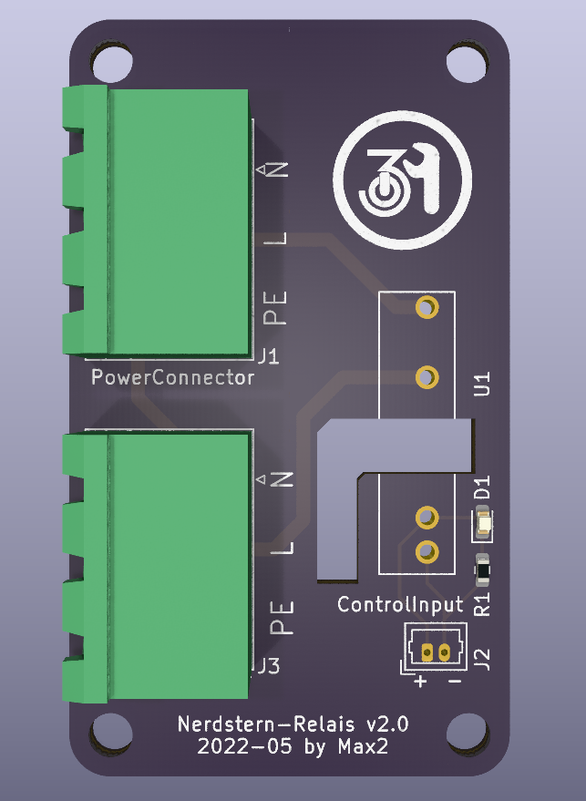
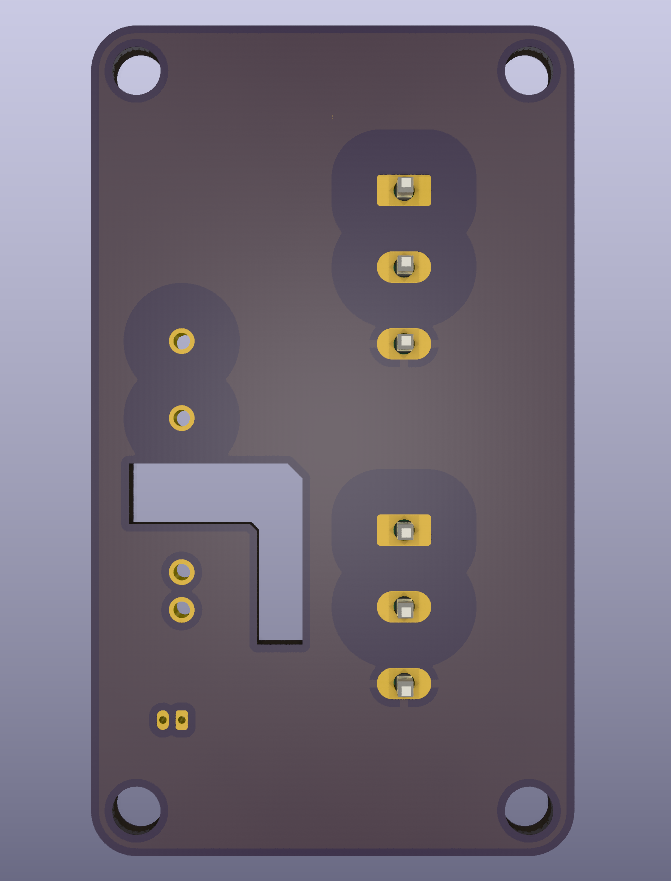

# Nerdstern control - v2 (2022)

This PCB contains a 12V solid-state-relais to control 230V nerdstern (outdoor lamp).
A blue LED lights up when the relais is activated.

## Requirements for v2.0

* 12V SSR with zero crossing
* 2x 3-pin connectors for 230V (N, L and PE)
* Molex 2-pin PicoBlade for 12V input
* blue status LED wired to 12V

## Known issues in v2.0
* the ground plane connected to PE should exclude the 12V relais area
    * separate copper plane on existing board to a distance of at least 5mm

## Pictures (v2.0)

